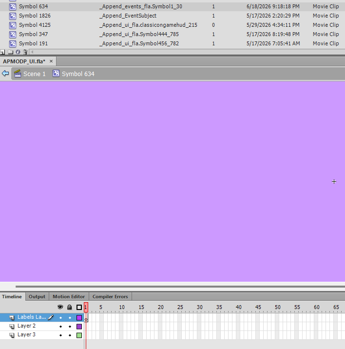

Notes for SWF modding (not very orderly)

# Locations

Since some locations for stuff is not incredibly clear it's been notated here

* Tile effects -> effects.fla

# Appending

## Events
* When making a custom event, for the drawing area bg use a appended object by the AS link (_Append_events_fla.Symbol1_30) and have nothing inside it. If you attempt to add more without proper frame link it starts to flash between all the background frames.

# Proof of Sincerity (FLAS)

I, (CVS), owner of the copies of documents events.fla, modular_cutscenes.fla, and ui.fla hereby recognize that any damages or malware given from the following documents must be attributed to my actions and causes. I (CVS) understand that these documents do not belong to me in any creative or licensable production and that I cannot personally gain from the copying or production of said documents. Any legal issues pertaining to LEGAL use of the copies of software (documents) or LEGAL admission of the copies of software (documents) that are proven to directly source from my copies of the documents are under my name and will be my actions. Users have the right to copy, modify and merge the document. All legal actions occuring with specific copies of these documents located (under my google drive) should include this set of statements. Users that withold this info are liable to personal charges and issues without my (CVS) interference or prescence. 

I (CVS) recognize that any user may follow these liscences with the following exceptions:

USERS ARE STRICTLY PROHIBITED FROM SELLING, PUBLISHING, OR DISTRIBUTING THE DOCUMENTS (SOFTWARE) IN ANY WAY THAT WOULD GIVE THEM PERSONAL MONETARY GAIN FROM THE CONTENTS OF THE DOCUMENTS. I (CVS) AM NOT LIABLE TO CHARGES IN TERMS OF WARRANTIES OF MERCHANTABILITY, FITNESS FOR A PARTICULAR PURPOSE OR NONINFRINGEMENT THAT PERTAINS TO ANY SORT OF DIGITAL OR CURRENCY RELATED CHANGING OR SHARING OF THE DOCUMENTS. I (CVS) MAY WITHOLD MY PRESCENCE IN ISSUES WITH IMPROPER COPIES, SHARES, AND SUCH THAT DO NOT PERTAIN TO THE INTENDED USE OF THE DOCUMENTS. PIRACY IS NOT A VICTIMLESS CRIME.
